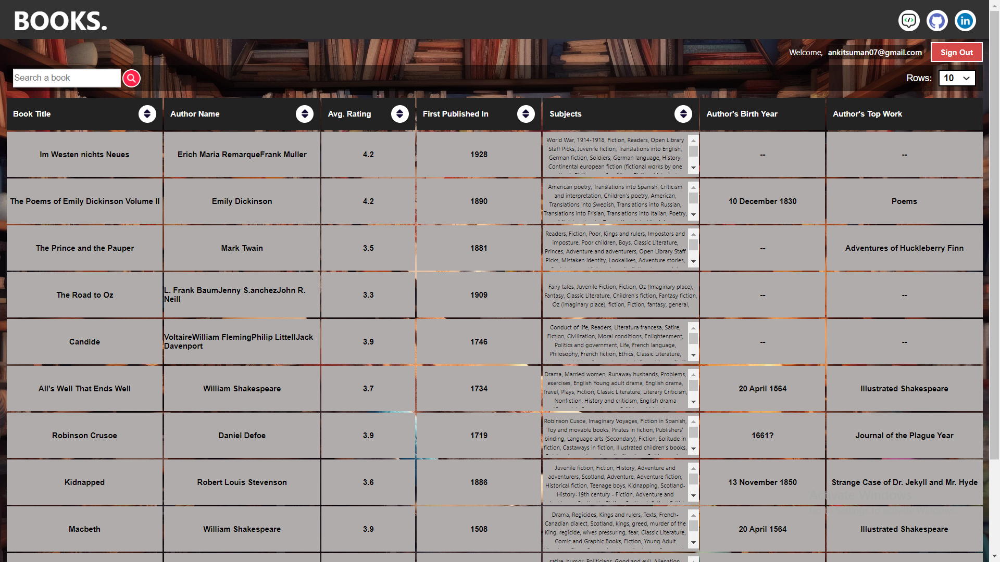
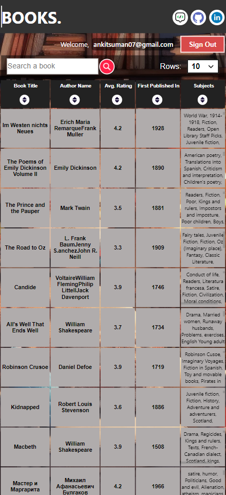
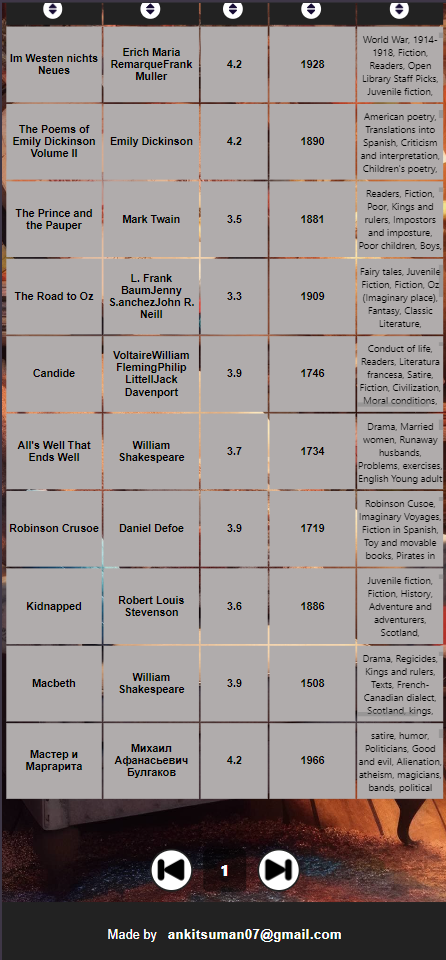

# Books Dashboard Made using ReactJS
A Frontend project made using ReactJS.

## Features
- **Authentication** implemented using Firebase
- Fetch API data using **axios** library
- Display the data in formatted tabular format
- **Search** for the book by it's title
- **Pagination** support
- Option to view **10**, **50** or **100** books in a single page
- **Sorting (aesc/desc)** functionality implemented for all the books column
- Ability to **download** current data in .csv format
- Web App made **responsive** and mobile-friendly
- **Deployed** through Vercel.com using Continuous Deployment.

## Deployed at: [Link](https://books-dashboard.vercel.app/)

## How to run locally

Step 1: Clone teh repository
```
https://github.com/ankit-suman-07/books-dashboard.git
```
Step 2: Open project folder
```
cd books-dash
```

Step 3: install dependencies
```
npm install
```

Step 4: install firebase
```
npm install firebase
```


Step 5: Create .env file and Update firebase details in it
```
REACT_APP_FIREBASE_API_KEY=apiKey
REACT_APP_FIREBASE_AUTH_DOMAIN=authDomain
REACT_APP_FIREBASE_PROJECT_ID=projectId
REACT_APP_FIREBASE_STORAGE_BUCKET=storageBucket
REACT_APP_FIREBASE_MESSAGING_SENDER_ID=messagingSenderId
REACT_APP_FIREBASE_APP_ID=appId
REACT_APP_FIREBASE_MEASUREMENT_ID=measurementId
```

Step 4: Run App
```
npm start
```


## Output Screenshots

### Authentication Page


### Loading


### Opening Screen


### Row Loading


### Table View



### Footer and Pagination


## Resume [PDF Link](https://flowcv.com/resume/ov7ge7b4pa)

